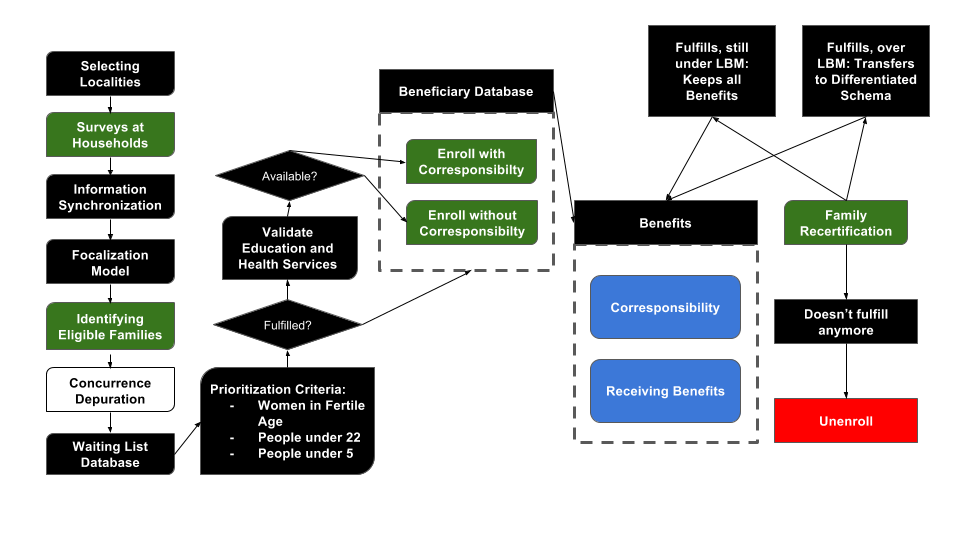

# Introduction

Mexico's Ministry for Social Development (SEDESOL) operates a range of social service programs to fight poverty in Mexico. One of their major challenges is how to effectively identify and target the families in most need. This section gives an overview of DSSG's work with SEDESOL to develop data-driven methods to assist on those challenges.

## Context

The organization in charge of quantifying poverty and evaluating social policy in Mexico is the National Council for the Evaluation of Social Development Policy ([CONEVAL](http://www.coneval.org.mx/) , in Spanish: Consejo Nacional de Evaluación de la Política de Desarrollo Social). They have developed a multidimensional measure of poverty, which includes six Deprivation Indicators, as well as Welfare Income Lines.

The six Deprivation Indicators were defined in @conevalindicators as follows:

1. Education - lacking the ability to attend school if in relevant age, or basic education if not.
2. Health Services - lacking affiliation to any health institution, via work benefit, government program or voluntary enrollment.
3. Social Security - lacking social security, for all employed, unemployed and elderly population.
4. Quality of the Dwelling - lacking of proper structure or enough space for inhabitants.
5. Basic Services on the Dwelling - lacking of water, draining or electricity.
6. Food - lacking of food security on any degree: low, moderate or severe.

On the other hand, the Welfare Income Lines are divided into four categories: first, they differ depending on the location type (urban or rural); second, there are two levels of welfare. The Minimum Welfare Line (LBM, in Spanish: Línea de Bienestar Mínimo) represents the income level a person needs to have in order to cover their food needs, while the Welfare Line (LB, in Spanish: Línea de Bienestar) includes other expenses related to basic goods and services. 

These values are published on a monthly basis by @conevallines. The current values for these Lines (in Mexican Pesos) can be consulted in the next Table.

Type    | Rural         | Urban
------- | ------------- | ------------
LBM     |  \$ 935.66    |  \$ 1,321.24 
LB      |  \$ 1,716.39  |  \$ 2,667.94 

Most recent CONEVAL numbers (2014) indicate that there were over 55 million people in Mexico living in poverty conditions. This represented around 46% of the population. We can see the distribution of the levels of poverty in Figure \@ref(fig:poverty-matrix-2014).

```{r poverty-matrix-2014, echo = F, fig.align = "center", out.width='0.6\\textwidth',fig.cap = "The $x$-axis represents the number of deprivations suffered, while the $y$-axis represents income. Farther to the left and closer to the bottom means deeper into poverty conditions. Source: @coneval2014poverty based on ENIGH"}

```

As a reference point, the Welfare Lines values at the end of 2014 were:

Type    | Rural         | Urban
------- | ------------- | ------------
LBM     |  \$ 914.89    |  \$ 1,291.93
LB      |  \$ 1,687.02  |  \$ 2,636.85 

## Our Partner

Our partner, The Ministry of Social Development ([SEDESOL](http://www.gob.mx/sedesol/), in Spanish: Secretaría de Desarrollo Social) was created in 1959, and has held its current name since 1992. Its primary goal is to create and manage social programs designed to support the Mexican people, with a clear basis on fighting poverty. SEDESOL pays special attention to the vulnerable sectors of the population, in order to help them overcome their poverty and margination condition.

They work towards this goal by creating social service schemes and strategies for social policy that protect the socioeconomical welfare of population sectors who find themselves in poverty, vulnerability, social exclusion or deprivation of basic needs. Correctly planning, executing and properly evaluating these strategies would help generate a more inclusive and equal society.

They also make an effort for breaking the poverty cicle by empowering both communities and the individuals who live in them via nutrition, education, training and employment programs, such that joining and staying in the workforce is easier. Thanks to this, families can come out of poverty by generating their own income and becoming productive exploting their skills.

Amongst the biggest social programs that SEDESOL currently manages to address its goal are:

1. [PROSPERA](http://www.gob.mx/prospera): conditional cash transfers for families under the Minimum Welfare Line labeled for food support, scholarships and school supplies. The benefitted families receive the transfers as long as the children in school age are studying and everyone in the household attends their free health clinic appointments.
2. [Seguro Popular](http://www.seguropopular.org/): health services for all the population, especially that which doesn't have access to them by either work benefits or private resources.
3. Programa de Apoyo Alimentario: now part of Prospera, provides food support for elegible families who are under the LBM.
4. [Liconsa](http://www.gob.mx/liconsa): subsidized milk for vulnerable families, such that everyone - especially the children - have access to better nutrition and can grow and develop properly.
5. [Programa de Estancias Infantiles para Apoyar a Madres Trabajadoras](http://www.gob.mx/sedesol/acciones-y-programas/estancias-infantiles-para-apoyar-a-madres-trabajadoras): free daycare for mothers who work, seek work or study, as well as for single fathers, who are under the Welfare Line given that they don't receive this benefit from work.
6. [Pensión para Adultos Mayores](http://www.gob.mx/sedesol/acciones-y-programas/pension-para-adultos-mayores): retirement pension for elderly people (over 65) given that they are not receiving any other retirement benefits from other organisms.

They also manage programs that are much more focalized and attend particular needs, such as support for small farms, artisans, migrants, employment fairs, etc. 

In order to receive many of these programs, potential beneficiaries take a standarized survey in their households called Single Questionnaire of Socioeconomical Indicators ([CUIS](https://www.gob.mx/cms/uploads/attachment/file/110994/Anexo_18A_CUIS.pdf): Cuestionario Único de Indicadores Socioeconómicos, in Spanish). This survey contains very detailed information about the beneficiares, under these categories:

* Housing: floor, walls and roof material, access to water and electricity, ownership, terrains for agriculture, number of rooms, etc.
* Individual: age, education level, indigenous heritance, illnesses, work benefits such as health and retirement, employment, income, nutrition and eating habits, etc.
* Household supplies: refrigerator, oven, vehicles, TV, stove, etc.

For a subset of the beneficiaries, specifically those who are applying to PROSPERA, there is a second part of the survey, called the Home Verification Module. This consists on the surveyor going inside the house of the potential beneficary who is taking the survey and visually verifying the veracity of the self reported answers, for the housing observable variables. The official guidelines for the survey processus can be consulted in @coneval2014surveymethod.

After this, every family undergoes a selection process which involves different elegibility criteria for every different program. As a general rule, programs target people who find themselves vulnerable or in poverty, by identifying them as having one (or possibly more) of the six Indicators and/or being below welfare lines of income.

Once a family or individual qualifies for receiving benefits for any of the social programs, they are registered into the Single Register of Beneficiaries ([PUB](http://pub.sedesol.gob.mx/spp/), in Spanish: Padrón Único de Beneficiarios) which contains all the transferences from diferent programs an individual has gotten over time. Nevertheless, not all of the beneficiaries in PUB have taken the CUIS, so the only known information about them is which programs they are receiving and - to some extent - the spatial context that surrounds them.

Some of the programs, especially the ones that involve recurring payments for an undefined period of time, need to periodically re-evaluate the conditions of their beneficiaries in order to gather information about whether they are still elegible for the benefits. This process of recertification is well known for PROSPERA. In order to recertify that households are still in need of help, the program visits them every seven years and generates a new survey. If the family is still below the LBM or above the LBM but still under the "Permanence Line", a line defined by PROSPERA which is above the LBM but still considered as poverty, they keep receiving the benefit; otherwise, they are unenrolled from the program. 

The process of enrollment and recertification for PROSPERA can be seen in Figure \@ref(fig:beneficiary-enrollment).

```{r beneficiary-enrollment, echo = F, fig.align = "center",out.width='0.6\\textwidth', fig.cap = "Any given family that wishes to receive PROSPERA benefits will go through this process in order to be enrolled/recertified. Source: privately shared by PROSPERA"}

```

## Problem Formulation

SEDESOL is interested in improving the targeting of the social programs it manages and make a better use of their resources, which include both public funds and human capital. As there exists incentives to misrepresent one’s socio-economic condition during the enrollment process, some people may receive benefits improperly taking resources away from those truly in need. On the other hand, of the 80 million individuals receiving benefits as recorded in the PUB database, only 20 million have completed home surveys in the CUIS database and as such are missing information about their true social deprivation indicators, which makes it very difficult to properly target social programs to them. 

On a more detailed level, the project has several goals, each of which can be formulated and approached with distinct models:

  1. Improve income estimation and under-reporting of beneficiaries using additional home verification information. Ideally, this model would provide likelihood (or risk) of inconsistencies in self reported income and housing situation. This would facilitate the detection of inclusion error and help make sure those in most need are receiving benefits.
  2. Derive socio-economic indicators for all beneficiaries in PUB, in the form of the six multidimensional poverty Indicators. These estimates would provide a more cost-effective mechanism to target and design social programs.
  3. Geo-locate households to assist in all deliverables. Geo-location would be an immensely useful feature for all of the three aforementioned models.
  
## Solution Approach  

To detect underreporting, we designed a model to imitate the process of surveyor verification, using the verification module as labeled data. Rather than predict questions individually, we aggregate them to a severity-of-underreporting measure and use this as the response variable. As predictors, we construct features from measurements available outside the verification module. In particular, we incorporate responses to the original survey and spatial coordinates.

For the imputation of poverty indicators, we used the intersection of CUIS and PUB as labeled data. On this subset of individuals, we learn a mapping from spatial, census, and program enrollment characteristics to the six poverty indicators.

The geolocation task was approached with the Google API to recover spatial coordinates, which enabled us to obtain socio-economical information at a block level for individuals.
