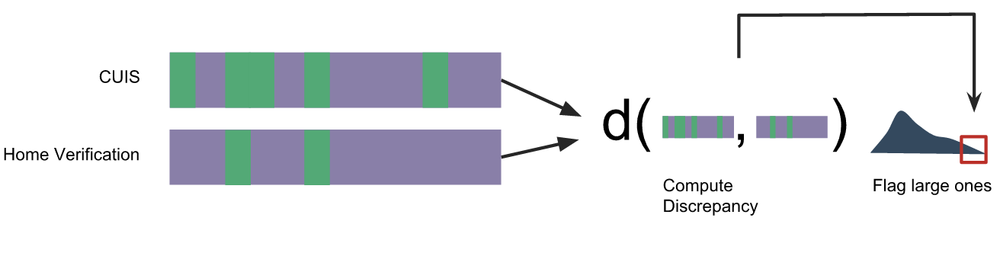

# Analytical Approach

Every one of the different subproblems is inherently different in content and purpose. Thus, different approaches are needed to properly utilize the available data, obtaining useful features and responses from it. In this section we give a detailed explanation of the approach we have chosen to give for gelocation, underreporting, and PUB imputation of social deprivations.

## Geolocation

Effective geocoding -- that is, the conversion of home addresses to
latitude / longitude coordinates -- is desirable because it yields a
potential source of features for various estimation problems. The
core challenge to overcome is the fact that many addresses are only
partially known. Fortunately, SEDESOL collects several sources of information to
supplement these partial addresses. For example, the locality to which each
home belongs is almost always known; further, side-street and settlement
level data are regularly collected. Hence, our overall strategy is to
combine complementary data sources to obtain a refined geocoding.

Ultimately, our goal is to identify the manzana associated with each home.
Given a latitude / longitude coordinate, this is a trivial spatial join
using manzana level spatial data from INEGI. Therefore, we focus on the
problem of identify the geocoded coordinates fore ach home.

Our current approach is to call the [googlemaps](https://github.com/googlemaps/google-maps-services-python)
library, a publically available API to Google Maps. This library expects
two input arguments: a search string and a component filter. The search
string corresponds to the text we would type into Google Maps website
online. The component filter constraints the search to a smaller geographic
region -- for example, a municipality or locality.

To construct the component filter, we use locality IDs and settlement names.
We use the INEGI locality database to map specific locality IDs to the state,
municipality, and locality names. These are given as input to the various
`administrative_level` fields in the filter. When it is available, we can also
provide the settlement name as a sublocality level filter.

To build the search string, we have currently implemented two approaches.
The first searches for the standard street address -- a street name and
home exterior number. While this allows exact geolocation of a home,
it is not always available. Further, when there are several streets with the
same name, the geocoder can mistake one street for the other. The second
approach is to use the name of the main and side streets around a home
to query for intersection level information. A positive aspect of this
approach is that pairs of intersecting street names tend to be unique
within a locality (which was not the case for single street names). Further
the coordinate of an intersection is sufficient for specifying the associated
manzana. The downside of this approach is that information on side streets
is not always complete.

To evaluate the geocoding methodology, we consider two metrics. First, we can
calculate the number of geocoded addresses where the settlement names agree with
known settlement names in the input data. Second, we can measure the proportion
of addresses geocoded to different levels of granularity, according to the API.

### Scaling the Geocoding Task
Using the Google geocoding API to geocode millions of addresses in a short time
is challenging because of the rate-limits imposed by Google. Google requires
that requests to the geocoding API be accompanied by a valid API key and limits
the number of keys that can be created per Google account. In addition, Google
limits the number of queries per key to
2500 per day. In order to get past these rate-limits, we collected 300 API
     keys,[^1] allowing us to geocode on the order of 750,000 addresses per
     day. We were able to run these queries from a single machine, and complete
     the geocoding exercise within ten days by using a parallelization factor
     of three requests at a time. (Google did not detect/block the use of
     multiple API keys from a single IP address).

[^1]: These keys were contributed by various DSSG fellows for the project, and
cannot be shared outside of DSSG. 

## Under-reporting Detection
To develop our under-reporting detection model we take into account three
factors: (i) under-reporting on any of the questions in the household survey,
(ii) difference between self-reported and estimated income, and (iii) distance
from minimum income poverty line.

We discuss each of the components below:

(i) A surveyee may under-report on any of the questions on the CUIS survey.
Using PROSPERA's home verification module as labeled data, we train a model to
predict whether the person is under-reporting on any of the questions in the
survey. **mj{is this a multi-response model? expand on this}** 

(ii) Unlike other questions for which we have labeled data through PROSPERA's
home-verification module, we do not have true income for most of the people.
However, people are likely to under-report their income, since it is an
important component for determining eligibility of various programs. To
incorporate income under-reporting in our over-all under-reporting score, we
use difference of self-reported income from SEDESOL's estimated income.
**mj{maybe put SEDESOL's estimated income in appendix and refer to it here?}**

(iii) Lastly, under-reporting is only an issue if it leads to enrolling a surveyee who
wouldn't have otherwise qualified for the program. Since most of SEDESOL's
programs take into account minimum income welfare lines when determine eligibility, the
model should incorporate some notion of the surveyee's distance from the
welfare line. To determine this distance, we use SEDESOL's current income
estimation model. **mj{how do we do the kernel function}**

**mj{How do we decide weights of the three components}**


###Previous Content on Under-reporting

The home verification component of the PROSPERA enrollment process
provides opportunities for automatically flagging potential
under-reporters, both in and out of PROSPERA. For detecting
under-reporters applying to PROSPERA, the main idea is to compute a
discrepancy score between the respondents' and surveyor's survey
answers; we discuss several variations of PROSPERA's current
process. One outcome of this study will be the identification of
questions frequently under-reported on the home verification
module. This knowledge can be transferred to programs outside of
PROSPERA, by downweighting commonly under-reported features when
establishing eligibility.

### Within PROSPERA

First, we consider the case of families applying to PROSPERA, for whom
we have a home verification module. We can frame the automatic
detection of under-reporters to the home verification module as
follows. Suppose $x_{i}, \tilde{x}_{i} \in \mathbb{R}^{p}$ are the
responses to the home verification module given by the family and
surveyor, respectively. For example, $x_{i}$ can be a vector of 0/1's
corresponding to $p$ appliances, with $x_{ij}$ equal to 1 when
respondent $i$ claims to own appliance $j$, and 0 otherwise. We could
also expand $x_{i}$ and $\tilde{x}_{i}$ to include supplemental
features, like socioeconomic context data collected by INEGI.

Given a pair of responses $x_{i}$ and $\tilde{x}_{i}$ for a single
household, we can encode the difference between them through a function
$d\left(x_{i}, \tilde{x}_{i}\right)$. This function is zero when the
respondent and surveyor are in complete agreement, and positive
otherwise. We can flag households with large discrepancies
$d\left(x_{i}, \tilde{x}_{i}\right)$ as in need of follow-up, because
their home verification modules appear to have very different results
than the self-reported responses. This approach is displayed in Figure
\@ref(fig:home-verification).

```{r home-verification, echo = FALSE, fig.align = "center", out.width='0.6\\textwidth', fig.cap = "A high view of under-reporting detection using under-reporting data. Self-reported and verification survey responses are represented by rectangles, 'positive' responses are green while 'negative' ones are purple. A distance is  computed between these responses, adn surveys with large discrepancies are flagged for further investigation."}

```

Therefore, the essence of this problem is in defining a distance
function $d\left(x_{i}, \tilde{x}_{i}\right)$. This is an unsupervised
analysis, as there is no objective list of "true" discrepancies with
which we can compare ourselves. Some basic choices are manhattan and
Jaccard distances for binary features and Euclidean distances for
continuous ones. A more sophisiticated approach, currently used by
PROSPERA, is to apply a function $f:x_{i} \to \text{income}$ from
survey responses to household income\footnote{We could also apply the
income estimation algorithm of the previous section at this stage},
and flag discrepancies in estimated income. Mathematically, this is
written as $d\left(x_{i}, \tilde{x}_{i}\right) =
d^{\prime}\left(f\left(x_{i}\right),
f\left(\tilde{x}_{i}\right)\right)$. As a special case, $d^{\prime}$
can be the absolute difference or relative change in estimated
incomes.

Different groups of features (e.g., education
related, or food-security related) can be given different
weights, for example, we might define $d\left(x_{i},
\tilde{x}_{i}\right) = \sum_{g \in
G}w_{g}d_{g}\left(x_{i}^{g},
\tilde{x}_{i}^{g}\right)$, where $x_{i}^{g}$ represents the subset of
features in group $g$ and $w_{g}$ are weights giving the importance of
group $g$ in calculating the discrepancy between surveys.

The simplest, and perhaps more natural, discrepancy to define between
surveys is to set it equal to the surveyor's human judgement of
whether the household is attempting to "game" the system. This
information is available both as a binary indicator (the answer to
the survey question "Is the respondent telling the truth") as well as
in a free text optional observations field.


### Households Not in PROSPERA

It may be possible to leverage the home verification data to identify
under-reporters outside of PROSPERA. The core idea is to use PROSPERA,
for which both self-reported and home-verification data are available,
to learn a model $f$ from the responses on the original survey,
$x_{i}$ directly to the discrepancy $d\left(x_{i},
\tilde{x}_{i}\right)$. This model can then be applied to data for
which no home verification data, $\tilde{x}_{i}$ is available. The
idea is that certain patterns in the original $x_{i}$ -- for example,
claiming not to have access to electricity in a region with developed
infrastructure -- might be associated with under-reporting, even
before the responses are verified.

## Imputation of Social Deprivations
The database of all beneficiaries, PUB, contains the monthly level benefit
transactions, for each person in the country receiving a social benefit from
the government.  Out of the 80 million beneficiaries in PUB, currently around
20 million of these people are within SEDESOL’s SIFODE database meaning that
   they completed the CUIS household survey. For this subset of beneficiaries,
   we have detailed socio-economic information and know which of the six needs
   (food, health, education, quality of dwellings, basic housing services, and
   social security) do they lack. 

To predict the deprivations for the beneficiaries missing household surveys, we
develop classification models for each of the six deprivations, with the binary
response being whether a person has the particular deprivation or not.

The datasets available to us for training these models are: (i) labeled SIFODE
data, (ii) census data, and (iii) beneficiary program enrollment data from PUB.
Note that any features derived from the CUIS questionnaire in the labeled
SIFODE data should be designed at an aggregate level (manzana/locality level),
since we do not have CUIS survey data for the beneficiaries for whom we are
trying to predict the social deprivations.

We first trained a range of models with aggregate features at locality-level
(for example, proportion of households in the locality with lack of access to
water as computed using SIFODE data). However, the accuracy of these models was
close to what a model that makes predictions randomly would have. A plausible
reason of this poor performance might be that localities are too broad and
diverse for locality-level features to have good prediction power.

Based on the results of the above exercise, we then shifted to manzana-level
features. A caveat of this shift is that our training and testing data reduces
significantly. This is because we have manzana-id information for only a subset
of beneficiaries. **mj: give numbers here**. 


## PROSPERA's current model

PROSPERA currently estimates income through a linear regression,
documented by @prospera_linear_model in their oficcial guidelines for 
evaluating socioeconomical conditions of households. It was implemented 
in 2010 and has been constantly revised. If we take $Y$ as the income,
it takes the form:

$$ln(Y) = \beta*X + \epsilon$$

As covariates, it takes features that are both easily observable and
obtainable from  standarized surveys and preferably related to structural
poverty in Mexico. Also, they grouped the variables based on correlation
amongst them and chose a representative one for each one of the groups.
This process yielded a total of 31 features for two different models:
rural and urban.

These features capture information about education, social security access,
employment, housing conditions, demographic conditions of the household,
household supplies, food security, and development conditions at locality
level.

