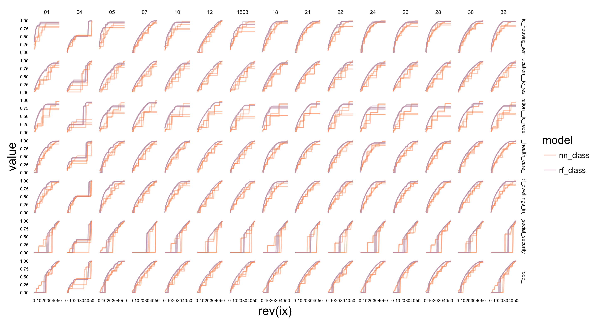
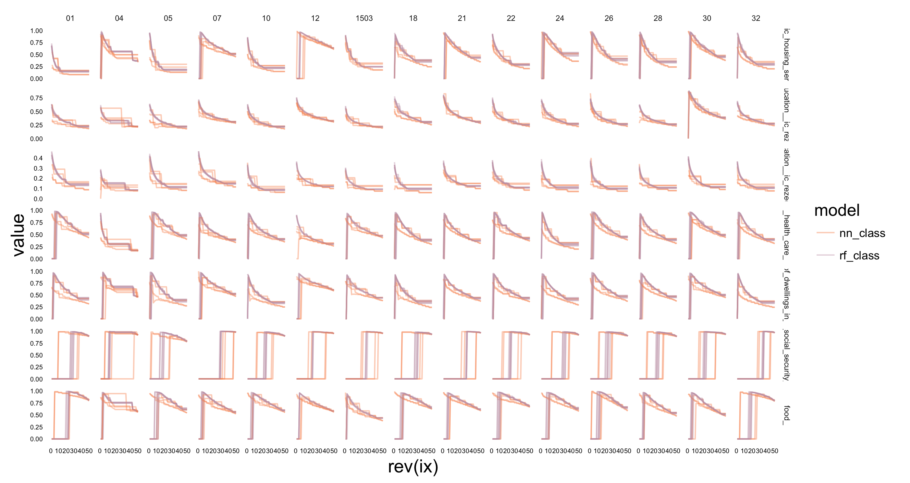

# Evaluation

All machine learning models must undergo evaluation to test their effectiveness for solving the problem that's being addressed. In this section, we explain the methodology used for evaluating, as well as show visualizations of the metrics used for this purpose.

## Methodology

The typical evaluation for the proposed models regarding all subjects relies on traditional methods based on partitioning data on training and testing sets. Since our semantic databases were created at a transaction level, creating the folds directly on them would have inevitably caused overfitting by having the same individual on both traning and testing sets.

For this project, our main method for evaluation is based on the Python package scikitlearn's Precision and Recall curves. These curves describe the information retrieval the model captures at each percentage of the population. Given a ranked list of how "confident" the model is on its predictions, we can compare the efectiveness of the model if one were to intervene on these confident  Precision represents how many of the tagged ones were true positives and recall is how many of the total positives have we tagged thus far. 

### PUB imputation

We can see precision on Figure \@ref(fig:pub-precisions) and recall on Figure \@ref(fig:pub-recalls) at state (entidad federativa) level. We can see the six different deprivations on each axis: services on the dwelling, both definitions of education[^2], health care, quality of the dwelling, social security, and food.

[^2]: This obeys the 1982 change regarding basic education: for people who were born before, it comprises until primary school (the equivalent of 6th grade), whereas for people born afterwards, it comprises also secondary school (the equivalent of 9th grade). 

We can see that for almost all cases, Random Forest Classifiers (rf\_class, purple) do a much better job than n-Nearest Neighbors Classifiers (nn\_class, orange), obtaning higher levels of recall. However, fitting different models at a state level gives us the flexibility to choose the best one for each case.

```{r pub-recalls, echo = FALSE, fig.align = "center",out.width='0.6\\textwidth', fig.cap = "The upper $x$-axis represents the state number, the lower $x$-axis represents the percentage of population covered, the right $y$-axis represents the deprivation and the left $y$-axis represents the value of recall."}

```

For precision curves, we can observe a different behavior: Random Forest is not the dominating best model.

```{r pub-precisions, echo = FALSE, fig.align = "center",out.width='0.6\\textwidth', fig.cap = "The upper $x$-axis represents the state number, the lower $x$-axis represents the percentage of population covered, the right $y$-axis represents the deprivation and the left $y$-axis represents the value of precision."}

```

TODO: maybe write the range of AUC we're getting for these?

### Underreporting

TODO: Our resulting precision and recall curves show that...


