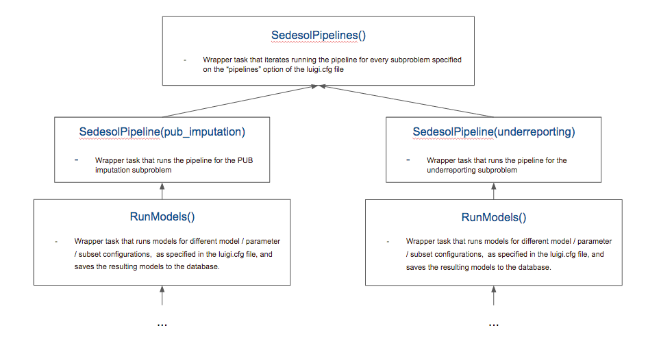
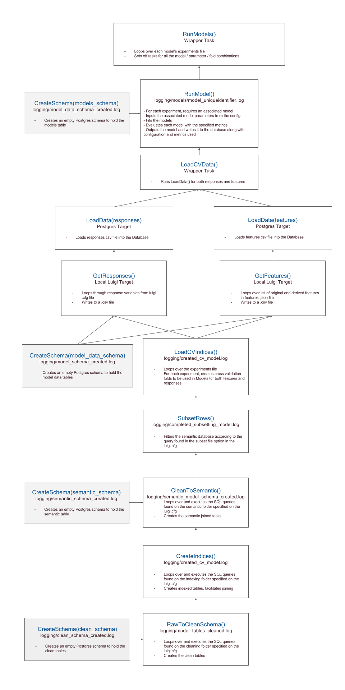
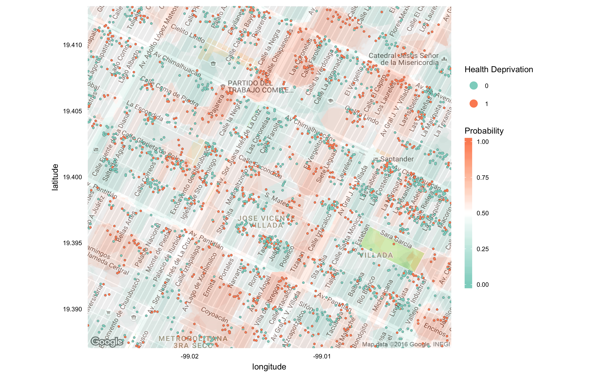
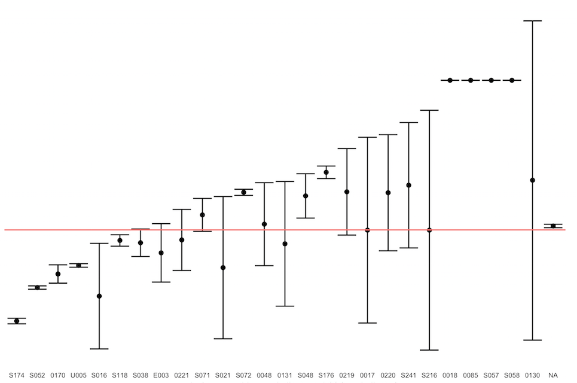
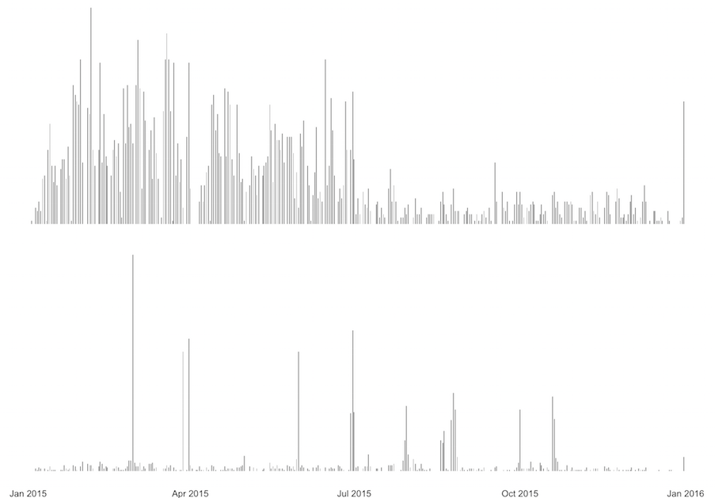

# Deployment Approach

An important focus of this project is to deliver a system that could be applied to all of SEDESOL's programs, on a longer term, and to new beneficiaries who enter SEDESOL's system. This requires a clear pipeline and the ability to update the model when more information about both new and curent beneficiaries becomes available. We present this pipeline in this section.

## Pipeline

We have developed a pipeline in Luigi that takes the raw different databases (including the ones provided by the partner in different formats and the ones that are publicly available), cleans them, performs merges to create semantic tables, creates features, deploys models and stores results. This allows the process to be ran programatically and easily process new data added to the raw databases.

This pipeline ties together all of the subproblems to be addressed. We have chosen this method because they all rely on the same few upstream operations, while the differences can be completely captured as personalized configuration parameters or `.sql` queries. These options are contained on the `luigi.cfg` file. In addition, this approach is flexible enough to disable running any of the subproblems depending on the desired outcome.

We can visualize the pipeline as follows:

1. Figure \@ref(fig:pipeline-top) shows the process of determining which subproblems will be run. Note that it is truncated at `RunModels()`.

```{r pipeline-top, echo = FALSE, fig.align = "center", out.width='0.6\\textwidth', fig.cap = "Source: created by the team"}

```

2. Figure \@ref(fig:pipeline-bottom) shows the same general structure for the tasks. Note that it starts ar `RunModels()`.


```{r pipeline-bottom, echo = FALSE, fig.align = "center", out.width='0.6\\textwidth', fig.cap = "Source: created by the team"}

```

The next `.json` files for configuration are required, one for each modeling problem inside the pipeline:

1. Preprocessing: contaning the steps to follow for preprocessing data: turning categorical variables into dummies, imputing median for missing values, etc.
2. Features: containing a True/False tagged list of features to include in the models. These can be either:
    * Direct features: which can be obtained directly as columns from the database, or
    * Derived feafutes: whose methods must exist in the `get_feature_funs.py` file.
3. Experiments: containing name, parameters and evaluation methods for each model.

## PUB imputation

We frame the PUB imputation as a person-level multiresponse binary classification
problem, using the data in SIFODE as training samples. Specifically, we imagine
\(Y_{sifode} \in \{0, 1\}^{n \times R}\) is a binary matrix of indicators across
$n$ individuals in SIFODE and $R$ social deprivations. We set $y_{ir}$ to 1 if
the $i^{th}$ person has the $r^{th}$ deprivation, and 0 otherwise. Before running
models, we must generate features $X_{sifode} \in \mathbb{R}^{n \times p}$, we hope
that $\mathbb{P}\left(y_{ir} = 1\right) \approx f_{r}\left(x_{i}\right)$. While we
could attempt to learn a vector $\hat{f} = \left(\hat{f}_{1}, \dots, \hat{f}_{R}\right)$,
jointly across responses, we instead learn each $f_{r}$ independetly of the rest^[See Future Work
for potential improvements, however]. We must assume that the relationship $f_{r}$ continues
to be true for the individuals in PUB; labeled data for individuals in PUB would have to
be collected to verify this.

Our modeling approach involves two complementary points-of-view: to get a general view
of the landscape of models, we automatically run models and feature sets through the
pipeline, while to understand individual models and features, we load the results of
model runs and perform exploratory analysis. Here, we describe some of the models we have
run for PUB imputation, along with the analysis we have performed to understand them.

### Features

Given an individual's transaction history of benefits within PUB along with their geographic
location, we designed features that we imagined might inform whether that individual
was likely to have any of the social deprivations. Our main classes of features were

* Spatial: Raw spatial coordinates and measurements of the intensity of the deprivation within a
  geographic location.
* Transactional: Characterizations of the individual's PUB transaction history.
* Socioeconomic: Manzana-level socioeconomic measurements, as collected by INEGI.
* Demographic: Characteristics reported directly from the CUIS.

We have run experimental, locality-level models using each of these features at a small
scale. However, our final predictions are based only on the raw spatial coordinates as
recovered by geocoding; these were the only models we ran at scale.

Our spatial data include manzana-level coordinates, whenever the geocoding
result is available^[However, we do not require the geocoding-quality to be "street-level" --
any non-null result returned by Google is considered.]. For almost all individuals, we
also have access to locality ids, so we also defined a locality-level coordinates
feature. We found however that the models using only locality-level coordinates were no
better than random. On the other hand, there appears to be spatial clustering in poverty
indicators at the manzana level. For this reason, we chose to focus all analysis on the
individuals for whom we have geocoding results. This fact also suggests the utility
of high-resolution geocoding and justifies future effort towards it.

A downside of directly using coordinates as features is that it only makes
sense with classifiers that can produce nonlinear decision boundaries. To use spatial
information in linear models, we defined a feature based on the distance to a
collection of prototypical latitude / longitudes, chosen via K-means. Specifically,
we chose $K$ prototypes $\(x_{k}\right)_{k =1}^{K}$ by clustering across individuals'
latitude / longitudes. We then featurize  a new point $x_{i}$ as
$\left(S\left(x_{k}, x_{1})_{k = 1}^{K}$, where $S\left(x, y\right) = \frac{1}{\sqrt{2\pi}\sigma}e^{-\frac{1}{2\sigma^{2}\|x - y\|^{2}}})$.
While this allowed us to use linear methods, we failed to observe any performance
gain, though it is possible that better choices of the bandwidth $\sigma$ might
improve the value of the feature.


```{r, echo = FALSE, fig.cap = "Example model fit using spatial coordinates. Points represent individuals, and are colored by the lack of healthcare. Background colors are fitted probabilities of the indicator, which can be used for prediction."}

```
### PUB imputation 

For transactional features, we have considered the number, rate, and total amount
paid over time from different programs. These features are based on the suspicion
that the programs within which an individual is enrolled are related to their needs.
This has been confirmed in exploratory analysis (Figure ) but has not translated into
gains in model performance, perhaps because the signal contained by enrollment in a
few programs was drowned out when including features based on all of them.

```{r, echo = FALSE, fig.cap = "Different programs serve individuals with different indicators. This figure displays the proportion of individuals enrolled in programs who have the lack of access to healthcare indicator. The error bars are smaller for programs with more beneficiaries. For example, few of the beneficiaries in S174 have the deprivation."}

```

#### Models used

A different type of transactional feature we considered is the time of enrollment, though
again this feature were never incorporated into our final results. We find that
individuals with certain deprivations are often enrolled in short bursts of activity
(Figure ). We suspect this is likely a program effect, or that the data were all entered
simultaneously some time after the original surveys. In either case, the feature could
still be useful for reconstructing the poverty indicators for individuals for whom
it is unobserved.

```{r, echo = FALSE, fig.cap = "Here are counts of the number of people who filled out a survey, split by whether or not they lack access to heatlhcare services (bottom and top, respectively). Evidently, there are time windows when relatively more individuals with the indicator are enrolled."}

```

#### Model selection

A different source of are the socioeconomic data measured by INEGI during the census.
These data are available down to the manzana level, and so could be linked to individuals
for whom we have geocoding results. Further, PUB directly provides some basic demographic
characteristics. While we have written functions to generate these features, we have not
systematically studied their impact on prediction accuracy.

### Models

Our most successful models, and the ones we experiment the most with via the pipeline,  were
random forest and nearest neighbors classifiers applied to latitude and longitude manzana
coordinates. We expect these models to be appropriate in light of the "patchwork" (nonlinear)
relationship between geographic location and poverty indicators. Kernel methods would also be
appropriate in this situation, however, they do not scale as easily; neural networks are
also a reasonable choice in this setting, but were avoided as were not available in our
(non-development) version of scikitlearn.

In addition to the random forest and nearest neighbors classifiers, we considered several
flavors of regularized linear classifiers -- specifically, regularized logistic regression
and elastic net -- for the feature sets that did not include direct manzana coordinates.
However, these models did not appear as effective as those including spatial coordinates.

Given a collection of nearest neighbors and random forest classifiers, we implemented
some ensembling methods to aggregate their predictions. The most basic one is to
average models predicted probabilities directly across models; these predictions are
the ones included in the final delivarable, given across all individuals in PUB
for whom geocoding results were obtained. We also implemented stacking, to upweight
those models that seemed to perform better. However, this approach is somewhat
slower, so never attempted to scale it to all individuals in PUB.

### Model selection

#### Features used

TODO

### Underreporting

We're looking for probability of underreporting: our response variable

#### Models used

Stochastic Gradient Descent Classifier
Extra Trees Classifier
Random Forest Classifier

Stochastic Gradient Descent Regressor
Random Forest Regressor

#### Model selection

TODO

#### Features used

* Temporal features: such as duration, start/end times, date of surveys. These turned out to have no impact on underreporting.
* Original features: all of the CUIS responses
