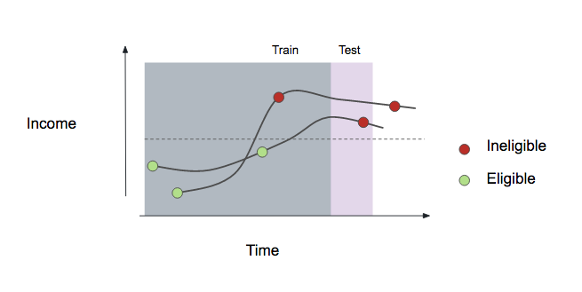
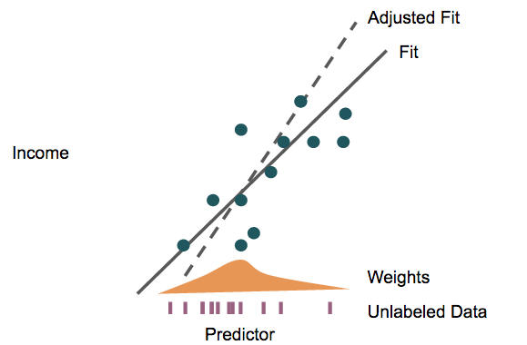

# Future Work

In this section we talk about some problems that are still to be approached.
For a wide variety of constraints, we could not dive into these as deep as
we would have wanted to, but leave them as open suggestions for further work.

## Household Recertification

While analysts at SEDESOL and PROSPERA have devoted energy to
developing income estimation and under-reporter detection models,
there is currently no quantitative system for prioritizing homes in
need of recertification. Instead, all homes are entered for
recertification every seven years. This extensive surveying places a
burden on SEDESOL's programs, and an automatic recertification
prioritization system could aid effective resources allocation --
homes likely to remain eligible may not require recertification.

We can frame this as a supervised machine learning problem by
considering each recertification as a separate sample. This is
possible because the data say whether a survey was conducted as part
of initial enrollment or as recertification. As a label, we use (lack
of) eligibility upon recertification. As features, it would be
desirable to use both (1) the past trajectory of the individual
households' responses over time and (2) the earlier survey responses
of "similar" households (this is in a similar spirit to collaborative
filtering). If historical data is more difficult to obtain, we could
expect most features to be constructed from (2). A cartoon version of 
this approach is given in Figure \@ref(fig:recertification-viz). 
The predicted probability of remaining eligible upon recertification
can be used to inform prioritization.

```{r recertification-viz, echo = F, fig.align = "center", out.width='0.6\\textwidth', fig.cap = "The two lines represent the incomes of two households over time; each survey is denoted by a circle. The goal of the recertification analysis is to predict the shade of the next circle using observed historical trajectories across households."} 

```

This model would be built with all historical CUIS data for beneficiaries:
taking as input the temporal component related to socioeconomical
conditions at each point of time in which the family was recertified
(found in the survey responses), and the labels taken as the result of said
CUIS surveys: whether the beneficiary received benefits from the program
that they applied to after going through the recertification process.
It could also incorporate geographical information amongst its features,
thus including the development of the localities they live in into the model.

## Income Estimation

The current model used by SEDESOL for income estimation follows CONEVAL's
approach and has been worked on extensively, in order to capture both as
much of the model's behaviour as possible, as well as including variables
related to the key components of structural poverty in Mexico. While this
approach gives a good understanding, there might be some room for improvement
whether it's concerning the model or the restrictions about the variables
used on it.

### ENIGH

We propose ensemble models that could potentially give better predictions
about income on ENIGH data. The feature importance obtained from these
models could be useful as to unveiling relationships between variables that
had not been studied yet, as well as possible improvements to the CUIS
survey for it to include variables that capture better socioeconomic
information.

We approach income estimation as a supervised regression problem. Our
features will be based on survey responses and spatial context, from
INEGI. We have access to two possible responses variables, (1) the
IMSS social security measurements and (2) the locality level estimates
provided by CONEVAL in the ENIGH survey, according to the methodology 
described by @prospera_linear_model. For this approach to improvement,
we have chosen to prioritize data from ENIGH, because it holds true 
representative data for all the population, rather than IMSS which only 
contains workers on the formal economy, and almost no data points for 
the population we're most interested in. 

### IMSS

Performing a straightforwards supervised model
using IMSS as a response variable ignores two possible sources of 
improvement. First, such an approach ignores unlabeled data -- 
individuals with no income data. The semi-supervised learning community 
has developed techniques designed to improve estimation in the presence 
of unlabeled data, and leveraging them may yield improvements in income
estimation, especially considering the scale of the unlabeled data 
relative to the labeled data @chapelle2009semi.

A second idea that may improve model performance is explicitly
modeling covariate shift @quionero2009dataset,
@huang2006correcting. The problem with naively using data from IMSS to
train a model is that individuals from IMSS are not a representative
subsample of the full population of SEDESOL beneficiaries, as they
tend to employed in the formal economy and be more financially
stable. Fortunately, the covariate shift literature has described
techniques for reweighting samples and features in order to match
characteristics between the groups. For example, one could try to
write a classifier with membership in IMSS as a response; those
samples that are truly from IMSS, but which we misclassified as coming
from the general population, will be upweighted in a subsequent income
estimation model. This general strategy is summarized in Figure
\@ref(fig:income-estimates).

```{r income-estimates, echo = F, fig.align = "center",out.width='0.6\\textwidth', fig.cap = "An idealized representation income estimation strategy. Blue points are IMSS labeled data, for which we have both predictors and true income values. The purple ticks along the `$x$`-axis correspond to unlabeled data from the general population. A comparison between the IMSS and general populations yields weights, given in the orange histogram, with which to re-estimate that incorporates unlabeled data and adjusts for covariate shift."}

```

One subtlety arises in evaluation of resulting model. In
the standard covariate-shift literature, the test data, while coming
from a different distribution from the training data, is in fact
labeled. Hence, evaluation can be done without reference to any
covariate-shift adjustments. In the income estimation setting, true
labels are not available on the general population.

Two potential workarounds are aggregating to the locality level and
comparing with known locality-level income data or using weights from
the covariate shift estimation in the loss to emphasize IMSS samples
more similar to the general population. The downside of the second
approach is that it ignores the uncertainty in the estimation of these
weights -- it does not cross-validate the full statistical procedure.

## Prioritization of Localities

One way of assisting all programs within SEDESOL is by characterizing
the eligibility rules for inclusion into a particular program, PROSPERA
for example, and then suggesting households in other SEDESOL programs
who are also eligible for inclusion.  This list can be aggregated up
to a block, locality or municipality level and take into account communities
that particular programs prioritize, such as women of reproductive age,
children, and elders for PROSPERA, and the deprivations they target:
food insecurity, literacy, etc. SEDESOL contains detailed questionaires
and the social deprivations for households currently enrolled in its programs,
in which case the task is relatively straightforward, but it does not have
this information for a large percent of its PUB beneficiaries database.

The households within the later case may be taken into account by
first imputing their social deprivations as described before and then
using that information along with their geo-location or locality, in the case
we don't have that information, and the list of programs for which they are
receiving support within PUB, we may cluster them with the population
of households for whom SEDESOL currently has questionnaires.  This process
will not allow us to derive demographic questionnaire data for these households,
but will give us the programs households similar to theirs are enrolled in,
thus allowing us to suggest them for possible inclusion into them, without
necessarily being able to prioritize them off demographic data.

